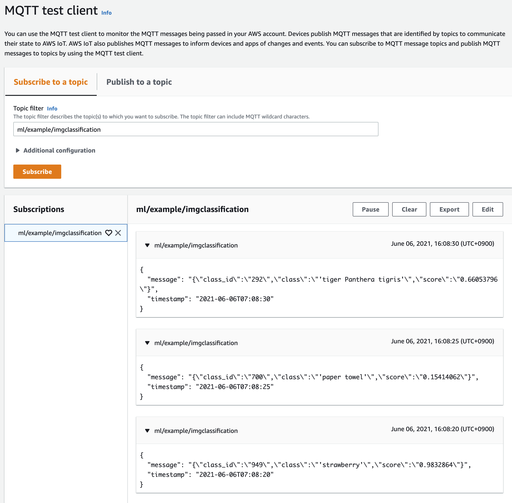
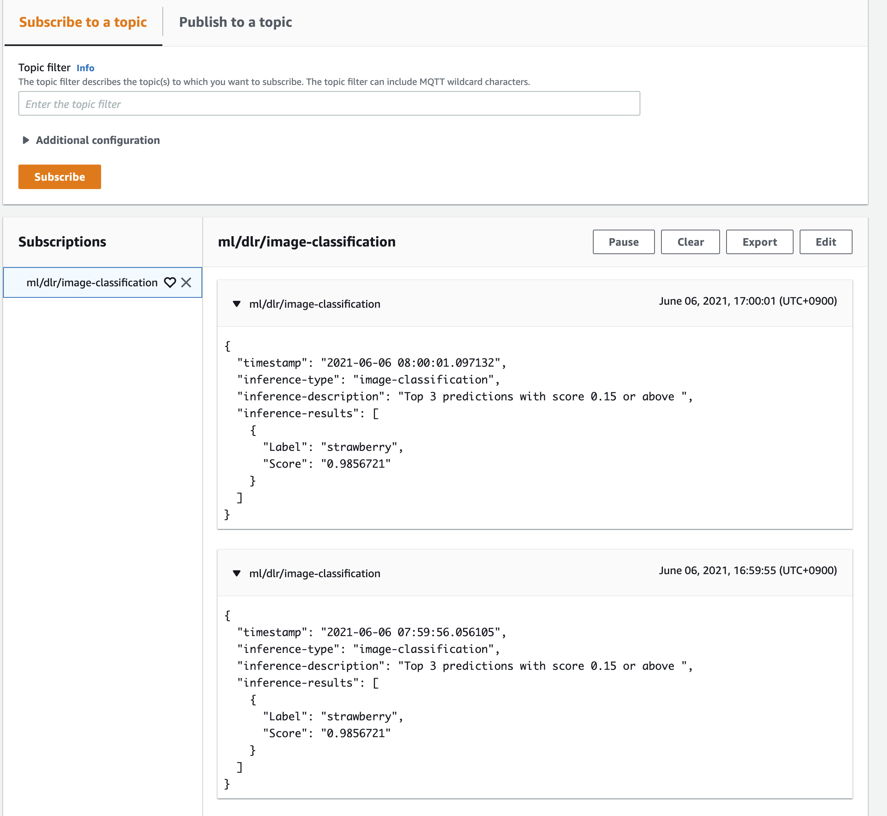
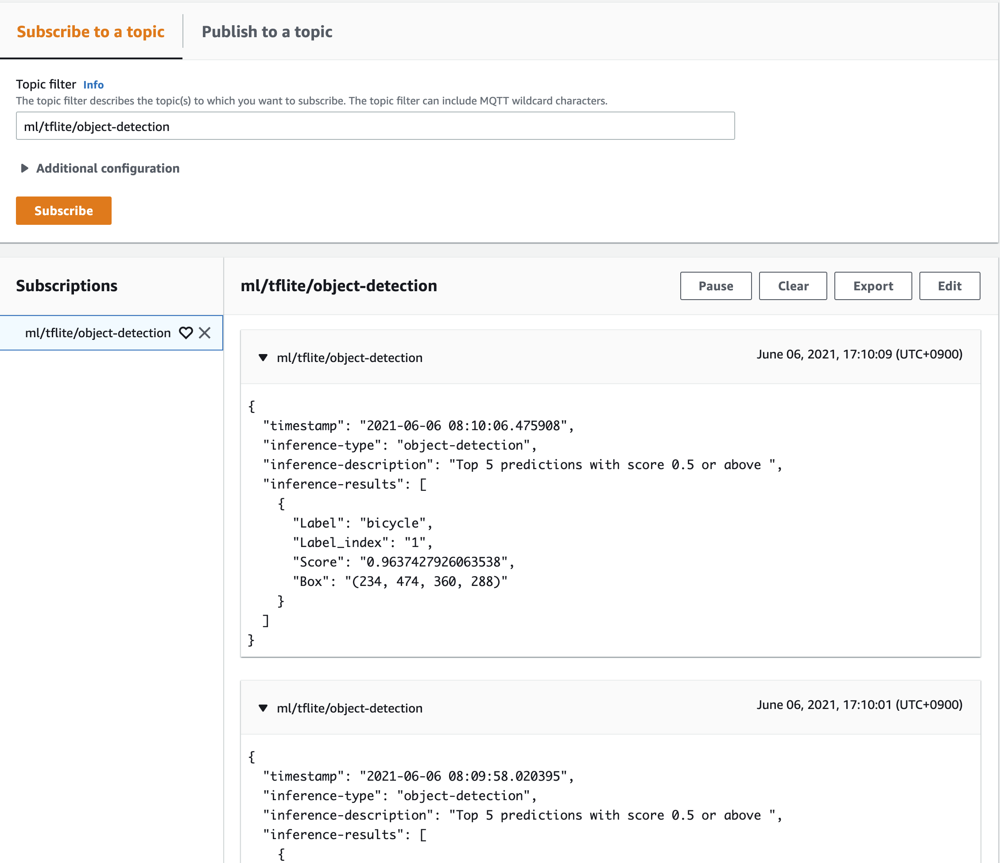
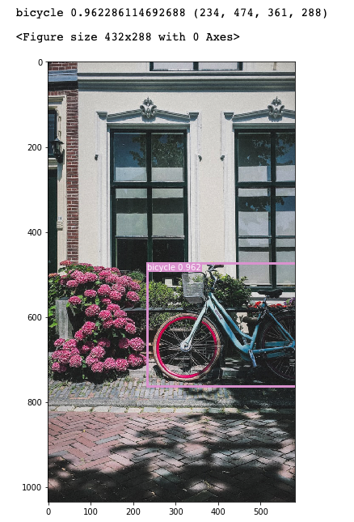

# ggv2-cv-mlops-workshop

This repository contains artifacts and recipes for deploying ML Inference components on AWS IoT Greengrass v2.

All the codes work normally, but there are many parts that need to be changed manually, so automation through CDK is recommended in the future.

<br>

## 1. DLR Image Classification From Scratch
---
### Overview
This example is written from scratch and it is a good place to start after 'Hello World' example.

**Model**: The model used in this example is the result of compiling PyTorch's torchvision pre-trained ResNet-18 with SageMaker Neo. For how to compile SageMaker Neo, see https://github.com/aws-samples/sagemaker-inference-samples-us/blob/main/pytorch-serving-neo.ipynb

### Deploy Model and Inference codes
1. Please execute the Greengrass Setup of the reference url. https://greengrassv2.workshop.aws/en/chapter3_greengrasssetup.html
2. Modify the config.json file in the editor to suit your environment.
    ```json
    {
        "Project": {
            "Name": "MLInferenceFromScratch",
            "Account": "12345*******",
            "Region": "us-east-1",
            "Profile": "ggv2-demo"
        },
        "Component": {
            "ComponentName": "com.example.ImgClassification",
            "ComponentVersion": "1.0.0",
            "SendMessage": "True",
            "Topic": "ml/example/imgclassification2",
            "PredictionIntervalSecs": 5,
            "Timeout": 10
        },
        "Artifacts": {
            "S3Bucket": "sagemaker-us-east-1-143656149352",
            "S3Prefix": "ggv2/artifacts",
            "ZipArchiveName": "my-model"
        },
        "Parameters": {
            "ScoreThreshold": 0.25,
            "MaxNumClasses": 3,
            "ModelInputShape": "(224,224)"
        }
    } 
    ```
3. Run the `init.sh` file on your local machine or the Cloud9 IDE. In this cell script, the following tasks are performed automatically.
   * Modify json recipe file in `recipes` folder.
   * Modify `config_utils.py` in `artifacts` folder.
   * Compress all contents of the `artifacts` folder into zip file and upload it to your S3 bucket.
   * Register your custom component to Greengrass v2. 
4. Deploy the component. We recommend deploying from the web console or using the greengrass-cli.
5. Open a new terminal window in the Cloud9 IDE to check the greengrass log and component log. 
    ```
    $ sudo tail -f /greengrass/v2/logs/greengrass.log
    $ sudo tail -f /greengrass/v2/logs/com.example.ImgClassification.log
    ```

    In `com.example.ImgClassification.log`, the following outputs should be continuously output.

    ```
    ...
    2021-06-06T06:40:29.920Z [INFO] (Copier) com.example.ImgClassification: stdout. predict={'message': '{"class_id":"949","class":"\'strawberry\'","score":"0.9832864"}', 'timestamp': '2021-06-06T06:40:29'}. {scriptName=services.com.example.ImgClassification.lifecycle.Run.script, serviceName=com.example.ImgClassification, currentState=RUNNING}
    ...
    ```

 1. After specifying the topic filter as `ml/example/imgclassification` in MQTT test client, perform Subscribe. The output should be something like the one below.
    

<br>

## 2. DLR Image Classification From Public Component
---
### Overview    

AWS has provided public components since IoT Greengrass v2, and you can freely import and deploy your models by modifying some logic without having to write code from scratch.

**Model**: The model used in this example is the result of compiling PyTorch's torchvision pre-trained ResNet-18 with SageMaker Neo. For how to compile SageMaker Neo, see https://github.com/aws-samples/sagemaker-inference-samples-us/blob/main/pytorch-serving-neo.ipynb

### Deploy Model Store
1. Compress all contents of the `model` folder into `model.zip` and upload it to your S3 bucket.
2. Edit the `model-store.json` file in the `recipes` folder. The Uri of the Artifacts entry should be your S3 path. For example,
   ```
      "Artifacts": [
        {
          "Uri": "s3://[YOUR-BUCKET]/model.zip",
          "Unarchive": "ZIP",
          "Permission": {
            "Read": "OWNER",
            "Execute": "NONE"
          }
        }
      ]
   ```
3. Deploy the Model Store component. We recommend deploying from the web console or using the AWS CLI.   

### Deploy Inference codes
1. Compress all contents of the `model` folder into `image_classification.zip` and upload it to your S3 bucket.
2. Edit the `img-classification.json` file in the `recipes` folder. The Uri of the Artifacts entry should be your S3 path.
3. Deploy the Model Store component. We recommend deploying from the web console or using the greengrass-cli.
4. Open a new terminal window in the Cloud9 IDE to check the greengrass log and component log. 
    ```
    $ sudo tail -f /greengrass/v2/logs/greengrass.log
    $ sudo tail -f /greengrass/v2/logs/aws.greengrass.DLRImageClassification.log
    ``` 

    In `aws.greengrass.DLRImageClassification.log`, the following outputs should be continuously output.

    ```
    ...
    2021-06-03T04:34:48.692Z [INFO] (Copier) aws.greengrass.DLRImageClassification: stdout. {"timestamp": "2021-06-03 04:34:48.645510", "inference-type": "image-classification", "inference-description": "Top 3 predictions with score 0.15 or above ", "inference-results": [{"Label": "strawberry", "Score": "0.52127737"}]}. {scriptName=services.aws.greengrass.DLRImageClassification.lifecycle.run.script, serviceName=aws.greengrass.DLRImageClassification, currentState=RUNNING}
    ...
    ```
 6. After specifying the topic filter as `ml/dlr/image-classification` in MQTT test client, perform Subscribe. The output should be something like the one below.
    


<br>

## 3. TFLite Object Detection From Public Component
---

### Overview    

AWS has provided public components since IoT Greengrass v2, and you can freely import and deploy your models by modifying some logic without having to write code from scratch.

**Model**: This model is a conversion of yolov4.weight to TFLite, see the site below for details; https://github.com/hunglc007/tensorflow-yolov4-tflite

### Deploy Model Store
1. After downloading yolo4.weights, convert yolo4.tflite and save it in the model folder. You can refer to https://github.com/hunglc007/tensorflow-yolov4-tflite. (Note: This must be done in TensorFlow 2.3.1. An error will occur in higher versions of TensorFlow.)
2. Compress all contents of the `model` folder into `yolov4-model.zip` and upload it to your S3 bucket.
3. Edit the `model-store.json` file in the `recipes` folder. The Uri of the Artifacts entry should be your S3 path. For example,
   ```
      "Artifacts": [
        {
          "Uri": "s3://[YOUR-BUCKET]/yolo4-model.zip",
          "Unarchive": "ZIP",
          "Permission": {
            "Read": "OWNER",
            "Execute": "NONE"
          }
        }
      ]
   ``` 
4. Deploy the Model Store component. We recommend deploying from the web console or using the AWS CLI.   

### Deploy Inference codes
1. Compress all contents of the `model` folder into `object_detection.zip` and upload it to your S3 bucket.
2. Edit the `obj-detection.json` file in the `recipes` folder. The Uri of the Artifacts entry should be your S3 path.
3. Deploy the Model Store component. We recommend deploying from the web console or using the greengrass-cli.   
4. Open a new terminal window in the Cloud9 IDE to check the greengrass log and component log. 
    ```
    $ sudo tail -f /greengrass/v2/logs/greengrass.log
    $ sudo tail -f /greengrass/v2/logs/aws.greengrass.TensorFlowLiteObjectDetection.log
    ``` 

    In `aws.greengrass.TensorFlowLiteObjectDetection.log`, the following outputs should be continuously output.

    ```
    ...
    2021-06-06T08:09:10.826Z [INFO] (Copier) aws.greengrass.TensorFlowLiteObjectDetection: stdout. {"timestamp": "2021-06-06 08:09:07.369875", "inference-type": "object-detection", "inference-description": "Top 5 predictions with score 0.5 or above ", "inference-results": [{"Label": "bicycle", "Label_index": "1", "Score": "0.9637427926063538", "Box": "(234, 474, 360, 288)"}]}. {scriptName=services.aws.greengrass.TensorFlowLiteObjectDetection.lifecycle.run.script, serviceName=aws.greengrass.TensorFlowLiteObjectDetection, currentState=RUNNING}
    ...
    ```
5. After specifying the topic filter as `ml/tflite/object-detection` in MQTT test client, perform Subscribe. The output should be something like the one below.
    
6. (Optional) You can check the prediction result by overlaying it on the image. 
7. 